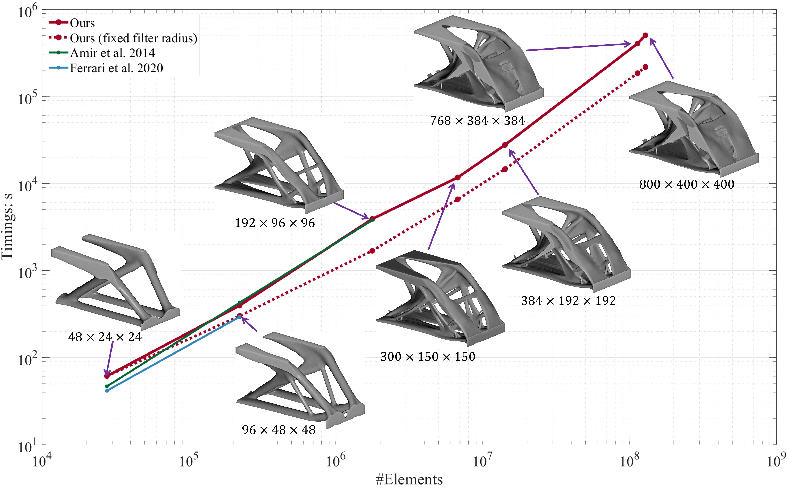

# TOP3D_XL

<p align="center">
  
</p>

This repository was created for the paper "Scalable 3D Topology Optimization with Matrix-free MATLAB Code" 
	by Junpeng Wang, Niels Aage, Jun Wu, Ole Sigmund and Rüdiger Westermann, 
submitted to the journal "Structural and Multidisciplinary Optimization" in 2025.05


# How to use it? 

Interface (Details are provided at the beginning of the code as well): 
```MATLAB
TOP3D_XL(inputModel, consType, V0, nLoop, rMin, varargin);
```

Syntax 1:
```MATLAB
%% Run Topology Optimization on the Cuboid Design Domain with Built-in Boundary Conditions
%% input volume: true(nely,nelx,nelz)
TOP3D_XL(true(50,100,50), 'GLOBAL', 0.12, 50, sqrt(3)); 
```

Syntax 2:
```MATLAB
%% Run Porous Infill Optimization on the Cuboid Design Domain with Built-in Boundary Conditions
TOP3D_XL(true(50,100,50), 'LOCAL', 0.5, 300, sqrt(3), 6);
```

Syntax 3:
```MATLAB
%% Run Topology Optimization on the External Design Domain Provided in *.TopVoxel
%% Download External Datasets (Femur, Molar, GEbracket): https://syncandshare.lrz.de/getlink/fiW6M69m5HoTUcH4T7wLKZ/ (until 2026.11.25)
TOP3D_XL('./data/Femur.TopVoxel', 'GLOBAL', 0.4, 50, sqrt(3));
```

Syntax 4:
```MATLAB
%% Run Porous Infill Optimization on the External Design Domain Provided in *.TopVoxel
TOP3D_XL('./data/Femur.TopVoxel', 'LOCAL', 0.5, 300, sqrt(3), 6);
```
